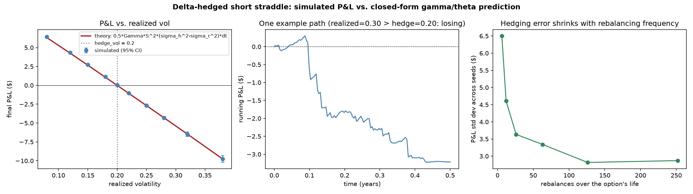

# Options Pricing & Volatility Research Toolkit

A pricing and volatility-trading research toolkit, built from first principles: three
interchangeable pricing engines, three implied-vol root-finders, a from-scratch Hidden
Markov Model for volatility-regime detection, and a closed-form theory of delta-hedging
P&L that gets checked against a mechanically simulated, self-financing hedge rather than
just asserted.

## Abstract

Most options-pricer projects stop at "here's Black-Scholes, here's Monte Carlo, here's a
payoff diagram." This one treats that as the *setup*, not the destination. The real
question it asks is: once you can price an option and compute its Greeks, what do you
actually *do* with them?

The answer implemented here is a full theory of delta-hedging P&L, derived from Itô's
lemma and the Black-Scholes PDE rather than trading-desk folklore, that reduces "theta
decay" to a single, testable formula: a delta-hedged position's P&L is
$\frac{1}{2}\Gamma S^2(\sigma_ {\text{realized}}^2 - \sigma_ {\text{hedge}}^2)\,dt$. That
formula is validated against a real, mechanically simulated self-financing hedge, not just
computed and assumed correct, and then used as the foundation for a regime-aware
gamma-scalping strategy: a Gaussian Hidden Markov Model, fit from scratch with Baum-Welch
and decoded with Viterbi, detects which volatility regime is active from a strictly causal
rolling window of returns and switches between being long or short gamma accordingly. The
strategy is graded honestly against fixed baselines, including in the case where it
doesn't clearly win.

Everything is organized around a small set of design choices, explained in
[Architecture](#architecture) below: a **functional core** of pure pricing/math functions
wrapped in a thin **imperative shell** of classes, pricing algorithms and IV solvers as
interchangeable implementations of a **Strategy** interface, and **factories** (plain
registries) that turn a name into a live object so experiments can iterate over "every
pricing engine" or "every named structure" generically instead of hardcoding a list.

## Highlights

- **3 pricing engines** (Black-Scholes closed form, Monte Carlo, CRR binomial tree — the
  only one that handles American exercise) behind one `PricingEngine` interface, each
  swappable via `create_pricing_engine(name)`.
- **3 implied-vol solvers** (Newton-Raphson, Brent, Jaeckel/Halley) benchmarked
  head-to-head across 250 (moneyness x maturity x call/put) combinations: Newton
  diverges catastrophically (max error > 8×10⁵) on 14.4% of a realistic grid; Brent and
  Jaeckel stay accurate to ~1e-7 everywhere.
- **A from-scratch 2-state Gaussian HMM** (Baum-Welch EM + forward-backward + Viterbi, no
  external HMM library) for volatility-regime detection, with a caught-and-fixed EM bug
  documented in [BACKGROUND.md](BACKGROUND.md) as a worked example of why you check a
  log-likelihood trace against an independent implementation instead of trusting that
  parameters "look about right."
- **A closed-form gamma/theta P&L theory**, derived from Itô's lemma + the Black-Scholes
  PDE, validated against a real self-financing delta-hedge simulation: mean simulated P&L
  tracks the theoretical prediction to within a few percent across a 10-point realized-vol
  sweep, 500 seeds each, and is statistically indistinguishable from zero exactly at the
  point where realized vol equals hedge vol (see [Results](#results-and-discussion)).
- **97 tests** (`pytest`), including regression tests for two real numerical bugs found
  during development: a binomial tree's naive finite-difference gamma collapsing to
  floating-point noise, and the HMM log-likelihood corruption mentioned above.
- **6 experiment scripts**, each producing a figure and a results table from actual runs,
  not illustrative placeholders — see [experiments/](experiments/).



## Table of contents

- [Background](#background)
- [Architecture](#architecture)
- [Package tour](#package-tour)
- [Experiment setup and assumptions](#experiment-setup-and-assumptions)
- [Results and discussion](#results-and-discussion)
- [What I'd build next](#what-id-build-next)
- [Running it](#running-it)

Full derivations for every formula in this project — Black-Scholes, the Greeks, GBM and
Itô's lemma, the binomial tree, all three IV solvers, the volatility smile, the
gamma/theta P&L identity, and the HMM math — live in [BACKGROUND.md](BACKGROUND.md).

## Background

Black-Scholes prices every option on a stock off one number, $\sigma$, held constant
across every strike and every maturity. Two things go wrong with that in practice, and
this project is organized around actually measuring both instead of mentioning them in
passing:

1. **The market doesn't believe the constant-vol assumption either.** Invert real option
   prices for their implied volatility and plot it against strike, and you get a smile or
   skew, not a flat line — direct empirical evidence that the model's central assumption
   is false (`surface.py`, `experiments/run_vol_surface.py`).
2. **If you trade options assuming a $\sigma$ that turns out to be wrong, there's a
   precise dollar cost or benefit to being wrong, and it's computable.** That's the
   gamma/theta P&L identity this project derives and validates, and it's the mechanism
   `theta decay` and `gamma scalping` actually refer to, once you write down the math
   instead of trading the words as folklore.

Once that mechanism is on solid footing, the natural next question is whether you can
predict, even crudely, which side of that formula you want to be on. That's what the
volatility regime detector is for — not because a 2-state Gaussian HMM is a sophisticated
forecast of real markets, but because it's the simplest tool that turns "I think
volatility is about to change" into a testable, causal, backtestable decision rule.
Testing it honestly, including reporting when it doesn't clearly help, is more informative
than either skipping the test or only reporting favorable results.

## Architecture

The package is split into a **functional core** and a thin **imperative shell**. Every
pricing formula — `black_scholes.price`, `black_scholes.analytic_greeks`,
`monte_carlo.price`, `binomial.price_and_greeks`, all three IV solvers' `solve` functions —
is a plain function of plain floats (and a `numpy` array or two), with no hidden state and
no side effects. You can call them directly, unit test them in isolation, or compose them
into a new experiment without ever touching a class. A thin layer of classes
(`BlackScholesEngine`, `MonteCarloEngine`, `BinomialEngine`) then adapts each pure function
set to a common interface so it can be swapped in generically.

This split exists because the two halves have genuinely different correctness properties
to get right. The functional core answers "is this formula correct," checkable by unit
tests and cross-validation against a structurally different method — closed form versus
simulation versus lattice all agreeing is much stronger evidence than any one of them
being merely self-consistent. The shell answers "does this fit the same interface as every
other pricing algorithm," checkable by whether experiments can iterate over engines
generically.

Pricing algorithms are a **Strategy**. `PricingEngine` is an abstract base class with two
methods, `price` and `greeks`. `BlackScholesEngine`, `MonteCarloEngine`, and
`BinomialEngine` each implement `price`; only `BlackScholesEngine` (closed-form
derivative) and `BinomialEngine` (tree-native — see [BACKGROUND.md](BACKGROUND.md) for why
naive bumping fails there) override `greeks`. Everything else inherits a Template Method
default that gets Greeks by bumping each input and re-pricing, the way a desk with only a
pricing calculator and no formula sheet would. The choice of pricing algorithm becomes a
runtime value instead of something wired into a call site:

```python
from optionspricer.pricing import create_pricing_engine
from optionspricer.market import MarketData, OptionSpec, OptionType

option = OptionSpec(strike=105, maturity=1.0, option_type=OptionType.CALL)
market = MarketData(spot=100, rate=0.05, vol=0.20)

for name in ["black_scholes", "monte_carlo", "binomial"]:
    engine = create_pricing_engine(name)
    print(name, engine.price(option, market).price)
```

The same pattern applies to `IVSolver` (`newton` / `brent` / `jaeckel`) and to named
option structures (`straddle`, `covered_call`, ... via `create_structure`).

The factories are plain registries on purpose. `create_pricing_engine`,
`create_iv_solver`, and `create_structure` each look a name up in a `dict[str, type]` (or
`dict[str, Callable]`) populated by `register_*` calls next to each implementation.
Adding a new engine means writing the class and calling `register_engine` beside it, not
editing a central `if/elif` chain. The registry is closed for modification and open for
extension, which is what lets `experiments/run_iv_solver_benchmark.py` iterate over
`available_solvers()` generically instead of relying on a hand-maintained list that
silently goes stale.

`OptionSpec` (contract terms: strike, maturity, call/put, exercise style) and `MarketData`
(spot, rate, vol, dividend yield) are frozen dataclasses, and they're deliberately kept as
two separate types instead of one bag of parameters. An option's terms don't change once
written; the market moves every tick; and an engine's signature `price(option, market)`
documents exactly which half of the world it's allowed to read. Nothing in this codebase
mutates either one in place — `structures.mark_to_market` and
`hedging.simulate_delta_hedge` both build new, time-shifted copies via
`dataclasses.replace` rather than editing an option's maturity as time passes. That
immutability is what makes it safe to reuse the same `OptionSpec` across an entire sweep
of market scenarios without worrying that some engine quietly changed it out from under
another.

## Package tour

```
src/optionspricer/
    market.py          OptionSpec, MarketData, Greeks, PriceResult -- the value objects
    simulation.py       GBM path/terminal simulation, regime-switching GBM
    surface.py          smile / term structure / surface construction from quotes
    data.py              live options-chain fetch (the only network-touching module)
    hedging.py            delta-hedge simulation + gamma/theta P&L attribution
    regime.py             from-scratch Gaussian HMM: Baum-Welch, forward-backward, Viterbi
    pricing/
        base.py            PricingEngine ABC + default finite-difference Greeks
        black_scholes.py    closed form + analytic Greeks
        monte_carlo.py       GBM simulation, reseeded for reproducible common-random-number Greeks
        binomial.py          CRR tree, American exercise, tree-native Greeks
        factory.py            create_pricing_engine registry
    implied_vol/
        newton.py / brent.py / jaeckel.py    the three solvers
        factory.py                             create_iv_solver registry
    structures/
        base.py     Structure, payoff_at_expiry, mark_to_market, portfolio_greeks
        factory.py   create_structure registry (straddle, spread, covered call, ...)
experiments/    one script per experiment; each writes a figure to experiments/results/
tests/          97 tests, one file per module above
```

### Pricing

Black-Scholes provides the closed form and the reference every other engine gets checked
against. Monte Carlo is an independent, structurally different cross-check that also
demonstrates the common-random-numbers trick for stable simulated Greeks. The binomial
tree handles American exercise, with Greeks read natively off the lattice instead of
finite-differenced — see [BACKGROUND.md](BACKGROUND.md) for why that distinction matters.

### Implied volatility

Newton for speed when it works, Brent for a guaranteed-to-converge fallback, and Jaeckel
for a normalized closed-form initial guess plus cubically convergent Halley iteration.
Jaeckel is the production default, since it combines Newton-like speed with Brent-like
robustness, falling back to Brent automatically if Halley doesn't converge.

### Structures

Every named multi-leg strategy — straddle, strangle, covered call, protective put, bull
call spread, and so on — is the same `Structure` type. `payoff_at_expiry`,
`mark_to_market`, and `portfolio_greeks` are written once, generically over legs, rather
than once per strategy. Portfolio Greeks aren't decorative: `hedging.py` reads a
structure's live delta to know how many shares to hold, and the regime-aware strategy
reads its gamma and theta to know what it's actually exposed to.

### Hedging and regime detection

`hedging.simulate_delta_hedge` is a real, mechanical, self-financing replication — cash
account, stock account, interest accrual, the works — not just an evaluation of the
theoretical formula, so the two can be checked against each other. `regime.py` is a
2-state Gaussian HMM implemented from first principles, with no `hmmlearn` or similar
dependency: Baum-Welch for fitting, the forward algorithm alone for causal/live regime
probabilities, and Viterbi for the best offline state path.

## Experiment setup and assumptions

A few assumptions, stated plainly, the way any simulation study should:

- **Continuous-time theory, discrete-time simulation.** The gamma/theta P&L formula is
  exact in continuous time; every simulation here rebalances at a finite interval (daily,
  by default), which introduces hedging-error variance around the theoretical mean without
  biasing the mean itself — checked directly, not assumed (see Results below).
- **No transaction costs, no bid-ask spread, no latency.** Every hedge trade happens at
  the simulated mid, instantly, for free. Real gamma-scalping P&L would be worse than
  reported here by whatever the trading costs actually are.
- **The regime-switching world is a stylized 2-state GBM**, not real market data — a
  Markov chain with persistent regimes and two fixed volatility levels. It exists to give
  the HMM detector a ground truth to be graded against (real markets never provide that);
  the live SPY smile experiment is the one place actual market data enters this project.
- **The HMM's own regime-classification accuracy was measured against that same
  simulator's ground truth**, not against real market regimes, which are not directly
  observable even in hindsight.
- **Reproducibility.** Every stochastic experiment seeds `numpy.random.default_rng`
  explicitly; `MonteCarloEngine` reseeds identically on every call so `price()` is a pure,
  reproducible function of its arguments (see [BACKGROUND.md](BACKGROUND.md) for why that
  also stabilizes its finite-difference Greeks).

## Results and discussion

Each subsection below reports numbers from an actual run of the corresponding script in
`experiments/`; re-running will reproduce them (or very close, given seeding) via
`uv run python experiments/<script>.py`.

### Monte Carlo convergence

`experiments/run_mc_convergence.py` prices the same call at $M \in \{100, ..., 10^6\}$
paths and tracks the estimate, its 95% CI width, and its error against the (known-exact)
Black-Scholes price of $8.021352$.

Fitted convergence rate (least-squares slope of $\log(\text{metric})$ vs. $\log M$):

| metric | fitted exponent | theory |
| --- | --- | --- |
| 95% CI width | $M^{-0.498}$ | $M^{-0.5}$ |
| \|MC − BS\| (single realization) | $M^{-0.420}$ | $M^{-0.5}$ |

The CI-width fit is essentially exact, since it's a deterministic function of the sample
standard error and has nothing to average away. The raw-error fit is noisier and
undershoots the theoretical exponent, which is the honest and expected outcome rather than
a discrepancy: a single realization's error is itself a random variable, and even though
its typical size shrinks at the $1/\sqrt{M}$ rate, any one seed's actual trajectory
wanders around that rate rather than tracing it exactly. Compare $M=2{,}000$'s error of
$0.115$ against $M=5{,}000$'s $0.305$: the error isn't monotonic run-to-run, only its
envelope is. This is exactly what the CLT promises, and nothing more.

### Implied-vol solver benchmark

`experiments/run_iv_solver_benchmark.py` prices calls and puts at $\sigma_ {\text{true}} =
0.35$ across a 5x25x2 grid (5 maturities, 25 moneyness levels, calls and puts), hands only
the resulting price to each solver, and checks the recovered $\sigma$ against
$\sigma_ {\text{true}}$.

| solver | median \|error\| | p99 \|error\| | max \|error\| | mean time/solve |
| --- | --- | --- | --- | --- |
| Newton | 8.1×10⁻¹³ | 3.1×10⁴ | **8.4×10⁵** | 122 µs |
| Brent | 4.7×10⁻¹² | 9.5×10⁻⁸ | 3.6×10⁻⁷ | 161 µs |
| Jaeckel | 6.1×10⁻¹⁶ | 1.5×10⁻¹¹ | 8.9×10⁻⁸ | 177 µs |

Newton's median error is the smallest of the three — it's genuinely faster and just as
accurate when it works — but 14.4% of the grid hits vega underflow, and its worst case
recovers $\sigma = 841{,}630.998$ against a true value of $0.35$. That's not imprecise,
it's a completely nonsensical number produced by a division-by-near-zero that compounded
over a few iterations before the safety check finally caught it (the mechanism is in
[BACKGROUND.md](BACKGROUND.md)). Brent and Jaeckel never do this: worst case for both is
error on the order of $10^{-7}$ everywhere on the grid, at roughly 30-45% more time per
solve. This is the concrete case for why `jaeckel.py`, not Newton, is the default used by
`surface.py` and `data.py` for building an entire implied-vol surface out of a live
options chain — a single silent Newton blow-up would corrupt the whole surface at one
strike, and there's no way to tell which strike without checking every single result
against a sanity range.

### American early-exercise premium

`experiments/run_american_premium.py`, $S=100$, $r=5\%$, $\sigma=25\%$, $T=1$:

- **Binomial → Black-Scholes convergence** (European call, ATM): error falls from $0.459$
  at 5 steps to $0.00124$ at 2,000 steps — consistent with a CRR tree's known $O(1/N)$
  convergence rate, and, being a structurally independent derivation from the closed form,
  real evidence both are implemented correctly.
- **American call = European call, exactly** (max difference across 13 strikes:
  $0.00 \times 10^0$), confirming the textbook result that early exercise of a call is
  never optimal without dividends.
- **American put premium grows monotonically with moneyness**, from $3.5\%$ of the
  European put's value at $K/S=0.70$ to $12.6\%$ at $K/S=1.30$ — a clean, textbook-correct
  shape, and a genuine dollar amount the binomial tree captures that Black-Scholes
  structurally cannot (a European closed form has no way to represent "the holder might
  act early" at all).

### Delta-hedging and the gamma/theta P&L identity — flagship, part 1

`experiments/run_gamma_theta_pnl.py` sells a straddle at hedge vol $\sigma_h = 0.20$,
delta-hedges it daily (126 rebalances over 6 months) against a stock realizing a *swept*
range of volatilities, 500 independent seeds per point, and compares the mean simulated
P&L against the closed-form prediction from the same simulated path:

| realized vol | simulated mean P&L | theoretical P&L | simulated − theoretical |
| --- | --- | --- | --- |
| 0.08 | +6.423 | +6.327 | +0.096 |
| 0.15 | +2.728 | +2.667 | +0.061 |
| 0.18 | +1.118 | +1.069 | +0.049 |
| **0.20 (= hedge vol)** | **+0.033 ± 0.038** | **0.000** | +0.033 |
| 0.22 | −1.053 | −1.072 | +0.019 |
| 0.28 | −4.315 | −4.302 | −0.013 |
| 0.38 | −9.766 | −9.757 | −0.009 |

The sign and shape are exactly as the theory predicts. Short gamma profits when the world
turns out calmer than priced ($\sigma_r < \sigma_h$), loses when it's wilder, and is
statistically indistinguishable from zero, $+0.033 \pm 0.038$ (1 SE), at the one point
where realized and hedge volatility coincide. Selling "fair" volatility and hedging it
perfectly breaks even on average, exactly as the derivation demands. The gap between
simulated and theoretical P&L is small and roughly symmetric around zero across the
sweep, consistent with it being discretization noise rather than a systematic error.

**Rebalancing frequency**, fixed at realized vol $=0.30$: the mean holds roughly steady
($-5.94$ at 6 rebalances down to $-5.54$ at 126) while the standard deviation across seeds
falls monotonically from $6.506$ to $2.817$ as rebalancing goes from weekly-ish to daily.
That's exactly the predicted split between an unbiased mean and shrinking hedging-error
variance. (At 252 rebalances the std ticks back up slightly, to $2.871$; with 300 seeds
per point, that's within sampling noise, not a reversal of the trend.)

### Regime-aware gamma scalping — flagship, part 2

`experiments/run_regime_gamma_scalping.py` builds a synthetic 2-regime world (calm
$\sigma=12\%$, turbulent $\sigma=35\%$, persistent Markov switching), prices a straddle at
the blended hedge vol $\sigma_h = 23.5\%$, and compares three strategies over 400
independent 6-month episodes: **always short gamma**, **always long gamma**, and
**regime-aware** (a from-scratch HMM refit on a trailing 120-day, strictly causal window
of returns at the start of each episode, switching stance based on the filtered
probability of the turbulent regime).

| strategy | mean P&L | std | win rate | Sharpe-like | p5 | p95 |
| --- | --- | --- | --- | --- | --- | --- |
| short (always) | **+0.476** | 2.744 | 60.5% | 0.173 | −3.539 | 5.149 |
| long (always) | −0.476 | 2.744 | 39.5% | −0.173 | −5.149 | 3.539 |
| regime-aware | +0.450 | 2.710 | 57.0% | 0.166 | −3.578 | 5.407 |

Regime-detection accuracy against the simulator's own ground truth, at the decision point,
scales clearly with how much data the HMM gets to fit on:

| trailing window | classification accuracy |
| --- | --- |
| 40 days | 67.2% |
| 80 days | 79.6% |
| 120 days | 87.4% |
| 200 days | 89.8% |

Here's the honest finding: at 87.4% regime-detection accuracy, the regime-aware strategy
does not beat the simple always-short-gamma baseline. Its mean P&L ($+0.450$) is within
one standard error of the baseline's ($+0.476$; SE $\approx 0.14$ for both), and it shows
no tail-risk advantage either — p5 of $-3.578$ against the baseline's $-3.539$, marginally
worse, not better.

The mechanism is straightforward once the numbers are laid out. The calm regime is both
lower-volatility and the persistent, majority-time-share regime (stationary probability
$\approx 2/3$ under the chosen transition matrix), so simply always selling gamma at a
hedge vol calibrated above the long-run blended volatility already captures most of the
exploitable structure in this world. A regime detector has to be right often enough, and
switch decisively enough, to beat a baseline that's already biased in the right direction
most of the time, and a 120-day EM fit, while accurate most of the time, still
misclassifies roughly one decision in eight — enough to erase the edge it would otherwise
add. This isn't a failure of the detector: its accuracy scales sensibly with data, exactly
as a small-sample EM fit should. It isn't a failure of the theory either, since part 1
above is validated cleanly. It's a genuine, informative negative result about how hard it
is to convert a moderately accurate signal into an edge on top of an already-good
baseline, and it's reported here instead of quietly re-tuned until it looked better.

### Live SPY volatility surface

`experiments/run_vol_surface.py` (network-dependent, best-effort): a live pull recovered
3,441 valid implied-vol points (of 3,636 quotes within a ±25% moneyness band, after
no-arbitrage filtering) across 30 distinct listed maturities, from roughly 1 day to 2.4
years out. See `experiments/results/vol_surface_SPY.png` for the smile, term structure,
and interpolated surface from that pull — regenerate with
`uv run python experiments/run_vol_surface.py [TICKER]` for a current snapshot, since this
one is a live market pull and will look different by the time anyone else runs it.

## What I'd build next

- **Statistical, not omniscient, informed signals for the regime world** — the current HMM
  world is already causal (no lookahead), but a natural next step is calibrating the
  regime model to real realized-vol data instead of a hand-picked 2-state synthetic world,
  and checking whether the same accuracy-vs-window-length relationship holds there.
- **A local or stochastic volatility model** (Dupire local vol, or Heston) fit to the live
  SPY surface this project already builds — the surface shows exactly how and where
  Black-Scholes is wrong; the natural next step is a model that's consistent with it by
  construction, rather than one constant $\sigma$ per contract.
- **Transaction costs and discrete bid-ask spread** in the hedging simulation — real
  gamma-scalping P&L is worse than the frictionless number reported here, and by how much
  is itself an interesting, measurable question with the machinery already in place.
- **Longstaff-Schwartz (regression Monte Carlo)** for American options, as a second,
  structurally independent check on the binomial tree's American premium the same way
  Monte Carlo already cross-checks Black-Scholes for European exercise.
- **A 3+ state HMM**, or a continuous (rather than discrete) volatility state, to see
  whether the regime-aware strategy's marginal result in part 2 was a limitation of only
  having two coarse buckets to choose between.

## Running it

```bash
uv sync --extra dev        # installs numpy, scipy, matplotlib, pandas, yfinance, pytest
uv run pytest -q            # 97 tests
uv run python experiments/run_mc_convergence.py
uv run python experiments/run_iv_solver_benchmark.py
uv run python experiments/run_american_premium.py
uv run python experiments/run_gamma_theta_pnl.py
uv run python experiments/run_regime_gamma_scalping.py
uv run python experiments/run_vol_surface.py SPY   # needs a network connection
```

Each experiment script writes its figure to `experiments/results/` and prints its results
table to stdout — the numbers in this README are the actual output of those scripts, not
transcribed by hand from a plot.

## Stack

`Python 3.10+` · `NumPy` · `SciPy` · `pandas` · `yfinance` · `Matplotlib` · `pytest` · `uv`
